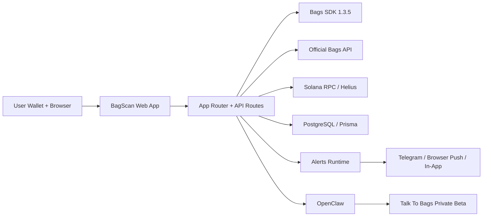
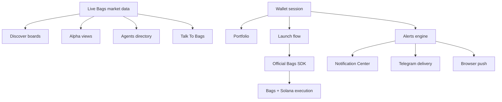
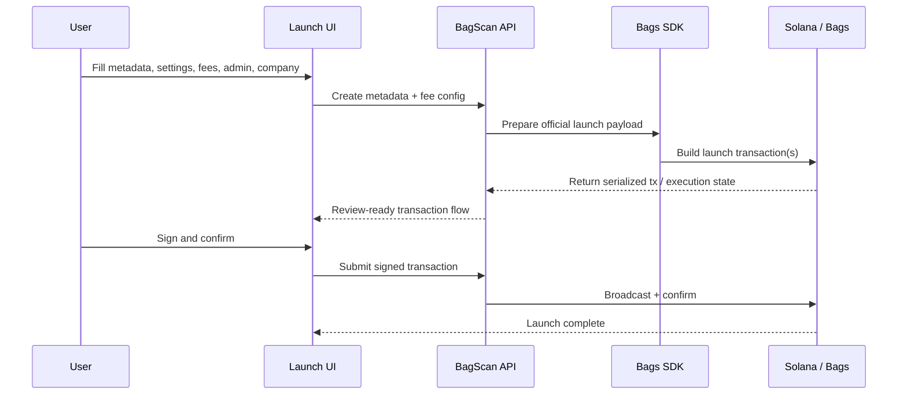
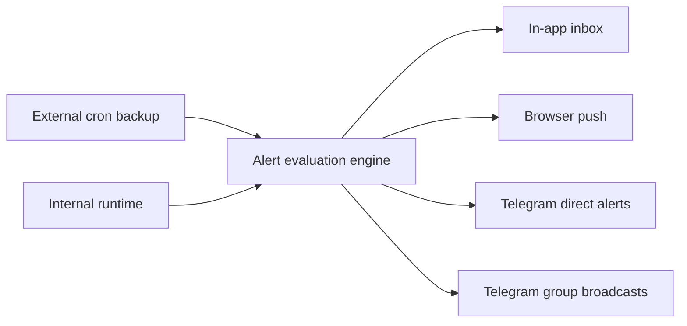

<div align="center">

# BagScan

### Solana discovery, Bags-native execution

BagScan is a premium discovery and launch terminal for the Bags ecosystem, with Solana-native wallet flows, official Bags SDK integration, alerts, portfolio tracking, and a growing assistant layer.

[](https://nextjs.org/)
[](https://react.dev/)
[](https://www.npmjs.com/package/@bagsfm/bags-sdk)
[](./LICENSE)
[](https://bagscan.app)

`DISCOVER` `ALPHA` `AGENTS` `LAUNCH` `PORTFOLIO` `ALERTS`

</div>

---

## What BagScan Does

BagScan brings Bags market discovery, launch infrastructure, partner monetization, portfolio visibility, and notification workflows into one terminal.

- Discover live Bags tokens through premium boards for trending, spotlight, new launches, hackathon, and leaderboard views.
- Launch tokens through the official Bags SDK with fee sharing, admin settings, company incorporation support, and safer transaction handling.
- Track holdings, estimated PnL, and claimable fee positions from a wallet-native portfolio surface.
- Deliver in-app, browser, Telegram, and Telegram group alert flows through a server-backed notification engine.
- Surface the Bags Hackathon ecosystem through dedicated boards for apps, AI agents, accepted projects, and category slices.
- Run `Talk To Bags` as a private-beta assistant layer backed by official Bags data and OpenClaw orchestration.

## Product Surface

| Surface | Purpose |
| --- | --- |
| `Discover` | Bags token boards, market slices, spotlight, and hackathon views |
| `Alpha` | Higher-conviction monitoring and premium Bags market views |
| `Agents` | Bags Hackathon AI agents directory with tokenized project enrichment |
| `Launch` | Token launch flow with official Bags SDK integration |
| `Portfolio` | Wallet-native holdings, fees, and PnL visibility |
| `Alerts` | In-app, browser, Telegram, and group broadcast notifications |
| `Talk To Bags` | Private-beta assistant for official Bags-backed answers |

## Architecture

### High-Level System



### Discovery And Execution Model



### Launch Flow



### Alerts Delivery



## Core Capabilities

### Discovery

- Premium terminal UI across trending, spotlight, new launches, hackathon, and leaderboard surfaces
- Official Bags market data blended with Bags-native discovery workflows
- AI Agents directory sourced from the Bags Hackathon category
- Curated spotlight rotation and current-pulse presentation

### Launch

- Official Bags SDK `1.3.5` integration
- Fee sharing and admin configuration
- Partner fee configuration support
- Company incorporation support in the launch flow
- Safer transaction confirmation and retry handling

### Portfolio And Alerts

- Wallet portfolio panel and full portfolio page
- Cost-basis-aware PnL work completed in product flows
- In-app inbox, browser push, Telegram direct alerts
- Telegram group broadcast targets
- Internal runtime plus external cron backup

### Talk To Bags

- Private beta / internal development surface
- OpenClaw orchestration layer
- Grounded around official Bags-backed responses
- Not fully published yet; kept behind a feature flag while being hardened

## Tech Stack

- `Next.js 16`
- `React 19`
- `TypeScript`
- `Tailwind CSS v4`
- `Prisma`
- `PostgreSQL`
- `@bagsfm/bags-sdk 1.3.5`
- `Solana Wallet Adapter`
- `TanStack Query`
- `Recharts`
- `web-push`

## Local Development

### 1. Install

```bash
npm install
```

### 2. Configure Environment

Copy `.env.example` into `.env` and fill in the required values:

```bash
cp .env.example .env
```

Most important variables:

- `DATABASE_URL`
- `NEXT_PUBLIC_SOLANA_RPC_URL`
- `HELIUS_API_KEY`
- `BAGS_API_KEY`
- `ALERTS_SESSION_SECRET`
- `ALERTS_CRON_SECRET`
- `TELEGRAM_BOT_TOKEN`

### 3. Generate Prisma Client

```bash
npx prisma generate
```

### 4. Push Schema

```bash
npm run db:push
```

### 5. Secure Public Tables

If your environment creates Prisma tables in the Supabase `public` schema, run:

```bash
npm run db:secure:public
```

See [docs/SUPABASE_SECURITY_HARDENING.md](./docs/SUPABASE_SECURITY_HARDENING.md) for details.

### 6. Start The App

```bash
npm run dev
```

Open `http://localhost:3000`.

## Environment Notes

- `ENABLE_INTERNAL_ALERTS_RUNTIME="true"` enables the server-side alert runtime.
- External cron for `/api/alerts/cron` can remain enabled as a backup.
- `Talk To Bags` is published behind an on-chain holder gate and currently requires a wallet holding at least `2.5M $SCAN`.

## Security

BagScan is designed primarily around server-side access to application data. Internal Prisma tables currently use RLS hardening when created in Supabase `public`, and the longer-term direction is to keep internal data in non-exposed schemas.

- Read the security process in [SECURITY.md](./SECURITY.md)
- Read the Supabase hardening notes in [docs/SUPABASE_SECURITY_HARDENING.md](./docs/SUPABASE_SECURITY_HARDENING.md)

## Contributing

Contributions are welcome. Before opening large changes, please describe the intended direction in an issue or discussion so the discovery, launch, and alert surfaces stay coherent.

Read [CONTRIBUTING.md](./CONTRIBUTING.md) before opening a pull request.

## Roadmap Direction

Near-term focus areas:

- Hardening `Talk To Bags` until it is ready for public release
- Continuing Bags-native launch reliability improvements
- Expanding assistant and notification workflows
- Improving Solana-wide discovery without losing Bags-native execution depth

## License

This project is licensed under the [MIT License](./LICENSE).
