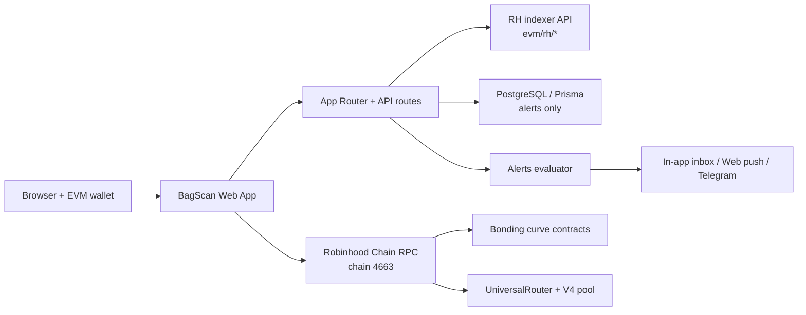
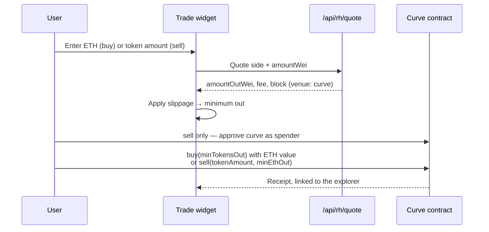

<div align="center">

# BagScan

### The Robinhood Chain token terminal

BagScan is a discovery, intelligence and trading terminal built for one network: **Robinhood Chain (`4663`)**. Live bonding-curve boards, flow-scored alpha, wallet portfolios with creator fee positions, wallet-signed alerts, and buy/sell across a token's full lifecycle — bonding curve before graduation, Uniswap V4 pool after.

[](https://nextjs.org/)
[](https://react.dev/)
[](https://wagmi.sh/)
[](https://robinhoodchain.blockscout.com)
[](./LICENSE)

`DISCOVER` `ALPHA` `PORTFOLIO` `ALERTS` `TRADE`

</div>

---

## What BagScan Does

- **Discover** every Robinhood Chain launch across two lanes — still filling its bonding curve, or graduated into a Uniswap V4 pool.
- **Read the flow** on an alpha board that scores indexed on-chain trades into curve momentum, volume spikes, buy/sell pressure, whale prints and crowd formation.
- **Track a wallet** — token holdings marked at the live curve price, ETH/WETH balance, and creator fee positions with claimable and lifetime totals.
- **Trade from the app** — bonding-curve trades before graduation, Uniswap V4 pool swaps after, with quotes from the chain indexer and a slippage bound you set.
- **Get alerted** when a watched token crosses a curve band, graduates, spikes on volume, moves sharply on price, or takes a whale trade.

## Product Surface

| Surface | Purpose |
| --- | --- |
| `Discover` | Bonding and graduated lanes, curve progress, spot price, FDV |
| `Alpha` | Signals scored from 7 days of indexed trades |
| `Portfolio` | Holdings, ETH balance and creator fee positions for any address |
| `Alerts` | Wallet-signed watches with in-app, push and Telegram delivery |
| `Token` | Detail page with live curve state, contracts, and in-app trading |

## Architecture


```mermaid
flowchart LR
    U[Browser + EVM wallet] --> W[BagScan Web App]
    W --> A[App Router + API routes]
    A --> B[RH indexer API<br/>evm/rh/*]
    A --> E[PostgreSQL / Prisma<br/>alerts only]
    W --> R[Robinhood Chain RPC<br/>chain 4663]
    R --> C[Bonding curve contracts]
    R --> P[UniversalRouter + V4 pool]
    A --> F[Alerts evaluator]
    F --> G[In-app inbox / Web push / Telegram]
```

### Where Each Piece Of Data Comes From

| Data | Source |
| --- | --- |
| Token lists, detail, portfolios, trades, quotes | Robinhood Chain indexer (`/evm/rh/*`), set via `RH_INDEXER_BASE_URL` |
| Balances, allowances, transaction sending | Robinhood Chain RPC, direct from the browser wallet |
| Watches, inbox, push subscriptions | PostgreSQL via Prisma |
| ETH/USD rate | CoinGecko, cached for 60s |

### Trading Flow

**Bonding curve (pre-graduation)**


```mermaid
sequenceDiagram
    participant User
    participant UI as Trade widget
    participant API as /api/rh/quote
    participant Chain as Curve contract

    User->>UI: Enter ETH (buy) or token amount (sell)
    UI->>API: Quote side + amountWei
    API-->>UI: amountOutWei, fee, block (venue: curve)
    UI->>UI: Apply slippage → minimum out
    User->>Chain: sell only — approve curve as spender
    User->>Chain: buy(minTokensOut) with ETH value<br/>or sell(tokenAmount, minEthOut)
    Chain-->>UI: Receipt, linked to the explorer
```

**Uniswap V4 pool (post-graduation)**

```mermaid
sequenceDiagram
    participant User
    participant UI as Trade widget
    participant API as /api/rh/quote
    participant Router as UniversalRouter

    User->>UI: Enter ETH (buy) or token amount (sell)
    UI->>API: Quote side + amountWei
    API-->>UI: amountOutWei, block (venue: pool)
    UI->>UI: Apply slippage → minimum out
    User->>UI: Wrap ETH / Permit2 approvals (one-time)
    User->>Router: execute V4_SWAP exact-in
    Router-->>UI: Receipt; sells auto-unwrap WETH proceeds
```

The curve ABI was recovered from live mainnet transactions — none is published. `buy(uint256)` is payable and takes a minimum-tokens-out bound; `sell(uint256,uint256)` takes the token amount and a minimum-ETH-out bound. Every token deploys its own curve contract, so the target address always comes from the token payload.

Pool swaps use the Robinhood-modified UniversalRouter (`minHopPriceX36` field required). Stock Uniswap SDK calldata will revert — calldata is encoded manually per the Bags trade guide.

## Core Capabilities

### Discovery
- Bonding and graduated lanes with live curve progress and spot pricing
- Exact lookup by pasting a `0x` contract address
- Valuation labeled honestly as FDV — every launch mints a fixed 1B supply and no circulating market cap exists on this chain

### Alpha
- Signals: curve momentum, volume spike, live flow, buy/sell pressure, price surge/dump, whale trade, crowd forming, fresh launch
- 7-day window, because Robinhood Chain flow is thin enough that a 24-hour view reads empty; the 24h slice is kept as a separate liveness indicator
- Bonding and graduated candidates are ranked in separate lanes so graduations (always at 100% progress) cannot crowd out the curve

### Portfolio
- Holdings valued at the live curve or pool price, with supply share
- Native ETH and WETH balances
- Creator fee positions: claimable now and lifetime earned
- No cost basis: the API indexes trades per token, not per wallet, so BagScan says so rather than guessing

### Alerts
- Sign in by signing a message — no transaction, no gas
- Per-token rules: curve bands (25/50/75/90), graduation, volume spike, price move, whale trade
- Each curve band fires once; a first sighting only establishes the baseline
- Delivery: in-app inbox, browser push (VAPID), Telegram

## Tech Stack

`Next.js 16` · `React 19` · `TypeScript` · `Tailwind CSS v4` · `wagmi 3` · `viem` · `TanStack Query` · `Prisma` · `PostgreSQL` · `web-push`

## Local Development

### 1. Install

```bash
npm install
```

### 2. Configure environment

```bash
cp .env.example .env
```

Required to run the market surfaces: `RH_INDEXER_BASE_URL` and `RH_INDEXER_API_KEY`.
Required additionally for alerts: `DATABASE_URL`, `ALERTS_SESSION_SECRET`, `ALERTS_CRON_SECRET`.

### 3. Push the schema (alerts only)

```bash
npx prisma generate
npm run db:push
```

The schema holds nothing but alert state: subscribers, watches, token snapshots, notifications and push subscriptions.

### 4. Start

```bash
npm run dev
```

Open `http://localhost:3000`.

## Network Reference

| | |
| --- | --- |
| Chain ID | `4663` |
| Currency | ETH (18 decimals) |
| RPC | `https://rpc.mainnet.chain.robinhood.com` (also `robinhood-rpc.publicnode.com`, `rpc.arrowrpc.com`) |
| Explorer | `https://robinhoodchain.blockscout.com` |

Note: `explorer.robinhood.com` does not resolve — the Blockscout instance above is the working explorer.

## Environment Notes

- `NEXT_PUBLIC_SITE_URL` sets the canonical origin for metadata, Open Graph, `robots.txt` and `sitemap.xml`.
- `ENABLE_INTERNAL_ALERTS_RUNTIME="true"` runs the alert evaluator in-process. Leave it off on multi-instance hosting and point external cron at `/api/alerts/cron` (bearer `ALERTS_CRON_SECRET`) so runs don't overlap.
- `GET /api/health` is a fast liveness probe with no database dependency.
- Production start binds `0.0.0.0` via `npm start` — set `PORT` to match your reverse proxy upstream.

## Security

- Alert sessions are HMAC-signed cookies over a wallet address proven by an EIP-191 signature; nonces are single-use.
- API routes log upstream errors server-side and return generic messages, so indexer internals never reach the client.
- Baseline security headers (HSTS, `nosniff`, `SAMEORIGIN`, Referrer-Policy, Permissions-Policy) ship from `next.config.ts`.
- Read the process in [SECURITY.md](./SECURITY.md) and the Supabase notes in [docs/SUPABASE_SECURITY_HARDENING.md](./docs/SUPABASE_SECURITY_HARDENING.md).

## Roadmap Direction

- Per-wallet trade history once an endpoint exists, unlocking cost basis and realized PnL
- Creator fee claiming from the portfolio instead of linking out
- Richer charting from indexed trades

## License

[MIT](./LICENSE)
